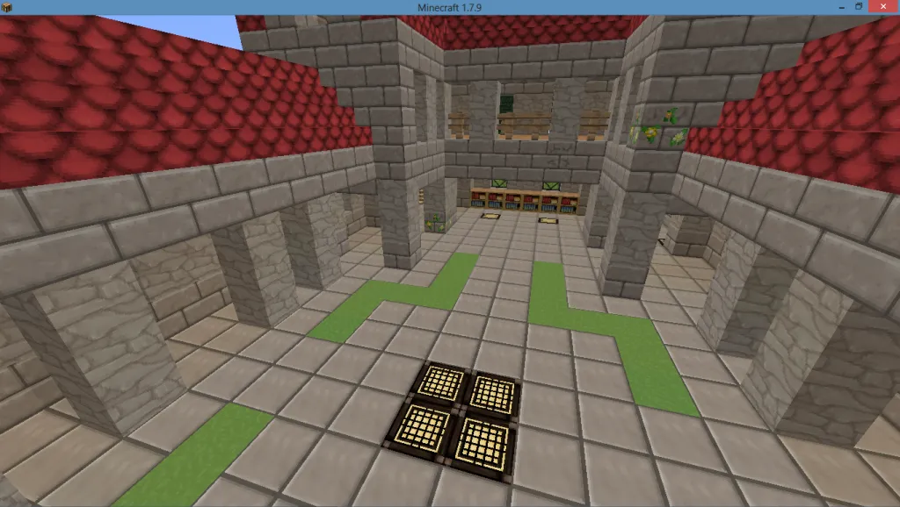

# OSReP: Open Source Resource Pack [32x32]

An unofficial backup of the [OSReP texture pack](https://www.minecraftforum.net/forums/mapping-and-modding-java-edition/resource-packs/2119572-32x-osrep-open-source-resource-pack) for Minecraft, because all its links are dead, it doesn't seem to have been archived, and resource packs that have open licences are the ones worth preserving.

This version was extracted out of the git history of [opencraft](https://github.com/GwenNelson/opencraft), the screenshots and resource pack compilation are by [Levi Kornelsen](https://www.minecraftforum.net/members/Levi_Kornelsen).

## Licence

See the images in `OSReP/credits` for licence requirements and attributions.

In summary:
 * the Music requires attribution
 * the licence requirements of the block graphics and item graphics can be met by Creative Commons Attribution Sharealike licences
 * the Doku stuff is unclear to me, clarrification from Dokucraft 2.5 may be required.
 
 
 
 
 
 
